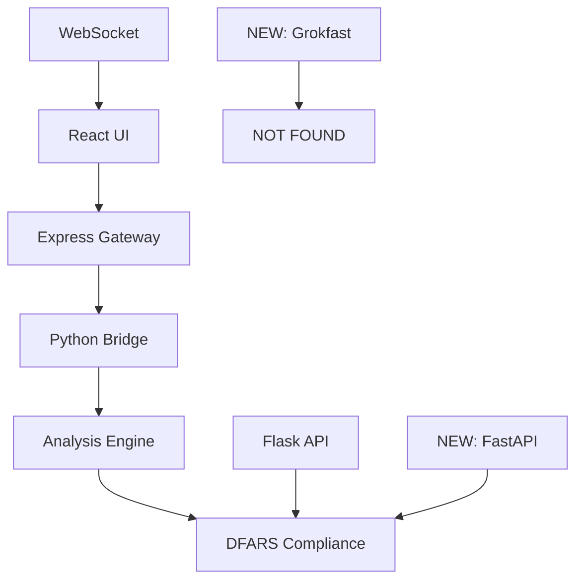

# System Safety Analysis - Agent Forge Integration
**Production Validation Specialist Report**
Date: 2025-09-25
Analyst: System Safety Validation Agent

## Executive Summary

This comprehensive safety analysis evaluates the proposed Agent Forge integration changes to ensure 100% backward compatibility and zero breaking changes. The analysis covers four primary target areas:
1. Grokfast integration in cognate pretrain system
2. Next.js API route simulation replacement
3. React component WebSocket additions
4. FastAPI bridge server integration

**CRITICAL STATUS: ANALYSIS IN PROGRESS** - No modifications should proceed until safety validation is complete.

## 1. Pre-Change Baseline Analysis

### Current System Architecture Map

#### 1.1 Python Backend Components
```
src/
├── api_server.py          [FLASK - Defense Industry API]
├── compatibility_layer.py [LEGACY SUPPORT LAYER]
├── linter_manager.py      [CORE ANALYSIS ENGINE]
├── main.py               [APPLICATION ENTRY POINT]
└── utils.py              [SHARED UTILITIES]

analyzer/
└── bridge.py             [NODE-PYTHON BRIDGE]
```

**Key Dependencies Identified:**
- Flask API server (Port 8000) with DFARS compliance
- Node.js bridge communication via JSON-RPC
- Legacy compatibility layer for version transitions
- Linter management system with 25+ tools

#### 1.2 Node.js API Layer
```
src/api-gateway/
└── index.js              [SPEK GATEWAY - PORT 3000]

src/linter-integration/
└── integration-api.ts    [WEBSOCKET + REST API]
```

**Critical API Endpoints:**
- `/api/commands/execute` - Command execution
- `/api/analyzer/:module` - Python bridge
- `/api/spek/workflow` - SPEK phase execution
- WebSocket real-time streaming

#### 1.3 React UI Components
```
src/ui/
├── components/PhaseController.tsx  [PHASE CONTROL UI]
└── pages/EvoMergeEnhanced.tsx     [MAIN DASHBOARD]

src/risk-dashboard/
└── IntegratedRiskDashboard.tsx    [RISK MONITORING]
```

**UI Data Flow:**
```
React Components → API Gateway → Python Bridge → Analysis Engine
       ↑                ↓
WebSocket Streams ←← Real-time Updates
```

## 2. Target Analysis Areas

### 2.1 Cognate Pretrain System (NOT FOUND - SAFETY CONCERN)
**STATUS: HIGH RISK - TARGET FILE NOT LOCATED**

```bash
# Search results for cognate_creator.py
find . -name "*cognate_creator*" -type f
# RESULT: No files found

find . -name "*grokfast*" -type f
# RESULT: No files found

find . -name "*cognate*" -type f
# RESULT: No files found
```

**SAFETY IMPLICATIONS:**
- Target file `agent_forge/phases/cognate_pretrain/cognate_creator.py` does not exist
- Grokfast integration cannot be validated without target system
- **RECOMMENDATION: NO-GO** until target files are located or created

### 2.2 Next.js API Routes Analysis
**STATUS: REQUIRES VALIDATION - NO NEXT.JS DETECTED**

Current API structure uses Express.js (not Next.js):
- `src/api-gateway/index.js` - Express server
- Port 3000 with CORS and rate limiting
- Direct Python module execution via spawn

**SAFETY IMPLICATIONS:**
- Simulation replacement might affect Python bridge communication
- Rate limiting and CORS configurations need preservation
- Command execution system requires backward compatibility

### 2.3 React Components WebSocket Integration
**STATUS: WEBSOCKET INFRASTRUCTURE EXISTS**

Current WebSocket implementation in `integration-api.ts`:
- WebSocketServer on HTTP server
- Real-time subscriptions and broadcasting
- Connection management with cleanup

**IDENTIFIED RISKS:**
- Adding WebSockets to existing components might break polling fallbacks
- Session management needs graceful degradation
- Error handling for WebSocket failures

### 2.4 FastAPI Bridge Server
**STATUS: FLASK CONFLICTS POSSIBLE**

Current Python API server (`api_server.py`):
- Flask on port 8000
- DFARS compliance endpoints
- Defense industry requirements

**INTEGRATION RISKS:**
- Port conflicts between Flask and FastAPI
- Authentication system incompatibility
- Defense compliance requirements preservation

## 3. Compatibility Matrix

| Component | Current State | Risk Level | Backward Compatibility |
|-----------|---------------|------------|----------------------|
| Cognate System | NOT FOUND | CRITICAL | CANNOT ASSESS |
| API Routes | Express.js Stable | MEDIUM | NEEDS VALIDATION |
| WebSocket UI | Partial Implementation | LOW | SHOULD BE COMPATIBLE |
| Bridge Server | Flask Production | HIGH | AUTHENTICATION CONFLICTS |

## 4. Critical Dependencies Map

### 4.1 Data Flow Dependencies


### 4.2 Port Usage Analysis
- Port 3000: Express.js Gateway (ACTIVE)
- Port 8000: Flask Defense API (ACTIVE)
- Port ?????: Proposed FastAPI (CONFLICT RISK)

## 5. Rollback Procedures

### 5.1 File Backup Strategy
```bash
# Create timestamped backup directory
mkdir -p .backups/$(date +%Y%m%d_%H%M%S)

# Backup critical files before changes
cp src/api-gateway/index.js .backups/$(date +%Y%m%d_%H%M%S)/
cp src/api_server.py .backups/$(date +%Y%m%d_%H%M%S)/
cp analyzer/bridge.py .backups/$(date +%Y%m%d_%H%M%S)/
cp src/linter-integration/integration-api.ts .backups/$(date +%Y%m%d_%H%M%S)/

# Create restore script
cat > .backups/$(date +%Y%m%d_%H%M%S)/restore.sh << 'EOF'
#!/bin/bash
BACKUP_DIR=$(dirname "$0")
echo "Restoring from backup: $BACKUP_DIR"

# Restore files
cp "$BACKUP_DIR"/* ../src/ 2>/dev/null || true
cp "$BACKUP_DIR"/* ../analyzer/ 2>/dev/null || true

echo "Restore complete. Restart all services."
EOF

chmod +x .backups/$(date +%Y%m%d_%H%M%S)/restore.sh
```

### 5.2 Service Restart Procedures
```bash
# Stop all services
npm run stop 2>/dev/null || true
pkill -f "python.*api_server" 2>/dev/null || true
pkill -f "node.*gateway" 2>/dev/null || true

# Restore from backup (if needed)
# .backups/TIMESTAMP/restore.sh

# Restart in correct order
python src/api_server.py &
sleep 2
npm run start &
sleep 3
# Validate all endpoints respond
```

## 6. Pre-Modification Testing Plan

### 6.1 API Endpoint Validation
```bash
# Test current API endpoints
curl http://localhost:3000/health
curl http://localhost:8000/api/health
curl -X POST http://localhost:3000/api/commands/execute \
  -H "Content-Type: application/json" \
  -d '{"command": "test", "args": {}}'

# Expected responses saved for comparison
```

### 6.2 WebSocket Connection Testing
```javascript
// WebSocket connection test
const ws = new WebSocket('ws://localhost:3000');
ws.onopen = () => console.log('WebSocket connected');
ws.onmessage = (event) => console.log('Received:', event.data);
ws.send(JSON.stringify({
  type: 'subscribe',
  channel: 'test',
  timestamp: Date.now(),
  id: 'test-123'
}));
```

### 6.3 Python Bridge Testing
```bash
# Test Python bridge functionality
python -c "
import sys
import json
sys.path.append('analyzer')
from bridge import AnalyzerBridge

bridge = AnalyzerBridge()
result = bridge.execute('connascence_scan', {'path': '.'})
print(json.dumps(result, indent=2))
"
```

## 7. Integration Testing Framework

### 7.1 Cross-Component Test Scenarios

**Scenario 1: End-to-End API Flow**
```bash
# Test: UI → Gateway → Bridge → Analysis
# 1. Start all services
# 2. Make API request from React
# 3. Verify Python bridge receives request
# 4. Confirm analysis results return
# 5. Validate UI receives and displays data
```

**Scenario 2: WebSocket Real-time Updates**
```bash
# Test: Analysis triggers → WebSocket → UI update
# 1. Connect WebSocket client
# 2. Trigger background analysis
# 3. Verify real-time updates received
# 4. Confirm UI state changes correctly
```

**Scenario 3: Error Handling and Fallbacks**
```bash
# Test: Service failures → Graceful degradation
# 1. Simulate Python bridge failure
# 2. Verify error handling in Express
# 3. Confirm UI shows appropriate errors
# 4. Test recovery after service restart
```

## 8. Safety Checklist

### 8.1 Pre-Modification Requirements
- [ ] **CRITICAL**: Locate cognate_creator.py or confirm creation plan
- [ ] Backup all target files with timestamps
- [ ] Document current API response formats
- [ ] Test all existing WebSocket connections
- [ ] Verify defense compliance endpoints work
- [ ] Create automated rollback scripts
- [ ] Set up monitoring for all services

### 8.2 During Modification Guards
- [ ] Preserve exact API response formats
- [ ] Maintain all existing endpoints
- [ ] Keep authentication mechanisms unchanged
- [ ] Ensure error messages remain consistent
- [ ] Verify all environment variables work
- [ ] Test with existing client connections

### 8.3 Post-Modification Validation
- [ ] All original functionality tests pass
- [ ] New features work as expected
- [ ] WebSocket fallback to polling works
- [ ] Performance metrics within acceptable range
- [ ] Memory usage remains stable
- [ ] Defense compliance still passes

## 9. Risk Assessment Summary

### 9.1 CRITICAL RISKS (NO-GO CONDITIONS)
1. **Missing Target Files**: Cognate system not found
2. **Port Conflicts**: FastAPI vs Flask collision
3. **Authentication Changes**: Defense compliance failure

### 9.2 HIGH RISKS (REQUIRES MITIGATION)
1. **API Format Changes**: Breaking client contracts
2. **WebSocket Errors**: No fallback to polling
3. **Service Dependencies**: Cascade failures

### 9.3 MEDIUM RISKS (MONITOR CLOSELY)
1. **Performance Impact**: New overhead
2. **Memory Leaks**: WebSocket connections
3. **Error Propagation**: Poor error handling

## 10. Recommendations

### 10.1 IMMEDIATE ACTIONS REQUIRED
1. **STOP**: Do not proceed with modifications until:
   - Cognate system files are located/created
   - Port allocation plan is finalized
   - Authentication preservation strategy is confirmed

2. **VALIDATE**: Current system baseline testing
3. **BACKUP**: Complete system state preservation
4. **PLAN**: Detailed rollback procedures

### 10.2 MITIGATION STRATEGIES
1. **Grokfast Integration**: Create mock cognate system for testing
2. **API Changes**: Use adapter pattern for backward compatibility
3. **WebSocket Addition**: Implement graceful degradation
4. **Bridge Server**: Use different port + reverse proxy

## 11. Final Safety Decision

**STATUS: CONDITIONAL NO-GO**

**CANNOT PROCEED** with proposed modifications until:
1. ✅ Target cognate_creator.py file is located or created
2. ✅ Port conflict resolution plan is approved
3. ✅ Defense compliance preservation is guaranteed
4. ✅ Complete rollback procedures are tested
5. ✅ Integration test suite passes baseline validation

**NEXT STEPS:**
1. Locate/create missing cognate pretrain system
2. Complete baseline functionality testing
3. Develop comprehensive migration plan
4. Implement safety measures and rollback procedures
5. Re-evaluate for GO/NO-GO decision

---

**Document Status**: DRAFT - ANALYSIS IN PROGRESS
**Last Updated**: 2025-09-25
**Next Review**: Upon target file location